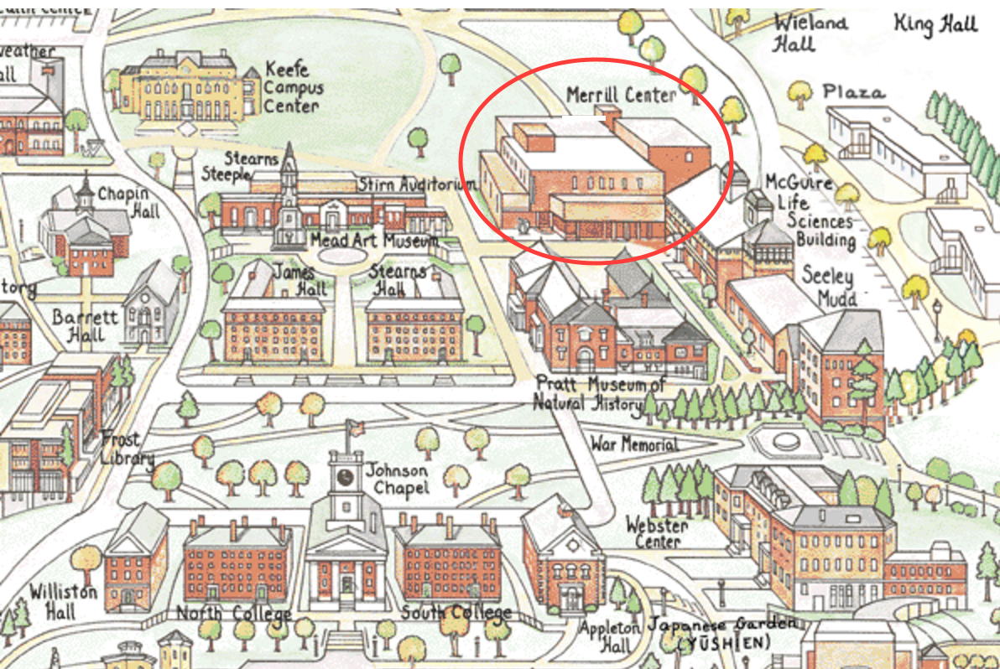

# Teaching Statistics Using R and RStudio Workshop (Amherst College, June 15, 2016)

The workshop is sponsored by the Amherst College Department of Mathematics and Statistics and the Boston Chapter of the American Statistical Association.

## Logistics

### Location

The workshop will be taking place in Merrill 131 (Amherst College Science Center).
Here's the part of the map that includes Merrill.

A full campus map can be found at http://www1.amherst.edu/about_amh06/visit/map/index.html

### Parking

Parking is available from noon to 5pm in the Alumni Parking lot (between Spring Street and College Street/Route 9 and between Alumni House and Seelye Street.

### Laptops

You'll be working on your own laptops: please be sure to bring it and power cord (we'll want to ensure that every pair of participants has a working laptop).

### Shared RStudio server

You should all have received login and password information for the shared RStudio server: please let me know if you didn't receive this.

## Schedule

- 12:15-12:30pm gather in Merrill 131 
- 12:30-12:45pm introductions and welcome
- 12:45-1:15pm Less Volume, More Creativity
- 1:15-2:00pm First steps on day 1
- 2:00-2:15pm Break
- 2:15-2:45pm More on RStudio and resources
- 2:45-3:45pm Case study: modeling course evaluations
- 3:45-4:30pm Closing thoughts and next steps

## Resources

### Workshop related

- http://www.github.com/Amherst-Statistics/RWorkshop2016-06 (this page)
- http://www.amherst.edu/~nhorton/workshop (workshop materials)
- http://www.amherst.edu/~nhorton/rstudio (student resources)

### Textbook related

- https://cran.r-project.org/web/packages/mosaic/ (mosaic vignettes and textbooks)
- http://www.amherst.edu/~nhorton/sdm4 (De Veaux, Velleman, and Bock Stats Data and Models)
- http://www.amherst.edu/~nhorton/is4 (De Veaux, Velleman, and Bock Stats Intro Stats)
- http://www.amherst.edu/~nhorton/ips6e (IPS 6th edition)

### General Stat Ed

- http://www.amstat.org/education/gaise/collegeupdate/GAISE2016_DRAFT.pdf (revised GAISE College report)
- http://www.amstat.org/education/resourcesforundergradteachers.cfm
- http://www.amstat.org/education/pdfs/Resources-for-Teaching-an-Intro-Stats-Course.pdf
- http://community.amstat.org/stats101/home (Stats 101 examples)
- http://causeweb.org (CAUSE)

### Thinking with Data

- http://amstat.tandfonline.com/doi/full/10.1080/00031305.2015.1094283 (Thinking with data)
- http://www.amherst.edu/~nhorton/precursors (developing precursors to "Thinking with Data")

### RStudio servers

- http://deanattali.com/2015/05/09/setup-rstudio-shiny-server-digital-ocean/
- https://www.causeweb.org/cause/ecots/ecots16/breakouts/7
